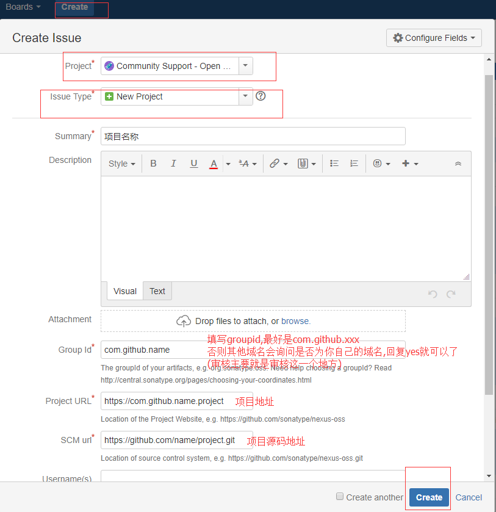

# 准备工作
- [https://issues.sonatype.org](https://issues.sonatype.org)注册帐号 （一定要保存下载,后面还会用到的）
- 注册完成后准备创建工单
1. 左侧顶部导航栏有个[Create](https://issues.sonatype.org/secure/CreateIssue!default.jspa)

2. 提交好后 在你的[Resolved recently](https://issues.sonatype.org/browse/)可以看到你要的工单
3. 这时你的工单的状态Status 是Open ，等到审核通过状态会变为RESOLVED ，如果是晚上提交审核会很块的,我大概花了5分钟左右 ，因为时差原因，他们工作时间是我们的晚上，满足基本要求基本就是秒过。

# 配置maven

1. ${MAVEN_HOME}/conf/setting.xml
```xml
<servers>
 <server>
    <id>sonatype-nexus-snapshots</id>
    <username>https://issues.sonatype.org的账号</username>
    <password>https://issues.sonatype.org的密码</password>
  </server>
  <server>
    <id>sonatype-nexus-staging</id>
    <username>https://issues.sonatype.org的账号</username>
    <password>https://issues.sonatype.org的密码</password>
  </server>
</servers>
```
2. 项目中pom.xml
```xml
 <parent>
        <groupId>org.sonatype.oss</groupId>
        <artifactId>oss-parent</artifactId>
        <version>7</version>
    </parent>
    <licenses>
        <license>
            <name>The Apache Software License, Version 2.0</name>
            <url>http://www.apache.org/licenses/LICENSE-2.0.txt</url>
            <distribution>repo</distribution>
        </license>
    </licenses>

    <!-- 项目管理 -->
    <scm>
        <url>https://github.com/name/project</url>
        <connection>https://github.com/name/project.git</connection>
        <developerConnection>https://github.com/name/project</developerConnection>
    </scm>

    <!-- 开发者信息 -->
    <developers>
        <developer>
            <name>developeName</name>
            <email>写你的邮箱就行</email>
            <url>https://github.com/name/project</url>
        </developer>
    </developers>

     <build>
        <plugins>

            <!--使用Maven Release Plugin执行发布部署-->
            <plugin>
                <groupId>org.apache.maven.plugins</groupId>
                <artifactId>maven-release-plugin</artifactId>
                <version>2.5.3</version>
                <configuration>
                    <autoVersionSubmodules>false</autoVersionSubmodules>
                    <useReleaseProfile>false</useReleaseProfile>
                    <releaseProfiles>release</releaseProfiles>
                    <goals>deploy</goals>
                </configuration>
            </plugin>
            <!-- 设置当前版本 mvn versions:set -DnewVersion=1.0.0  -->
        </plugins>
    </build>

    <!-- 我的pom.xml中<version>1.0.0</version>发行版本（不以-SNAPSHOT结尾） -->
```

# 配置GPG 用来对上传的文件进行加密和签名，保证你的jar包不被篡改
- [win下载](https://www.gpg4win.org/ )
- Debian / Ubuntu 环境
```
$ sudo apt-get install gnupg
```
- Fedora / centos 环境
```
$ yum install gnupg
```
- 安装完成后，查看版本
```
$ gpg --version
```
- 查看帮助
```
$ gpg --help
```
- 生成密钥
```
$　gpg --gen-key
```
- 生成密钥后会出现一对信息让你填写,对着填写就行
- 
```
gpg (GnuPG) 2.1.15; Copyright (C) 2016 Free Software Foundation, Inc.
This is free software: you are free to change and redistribute it.
There is NO WARRANTY, to the extent permitted by law.

Note: Use "gpg --full-gen-key" for a full featured key generation dialog.

You need a user ID to identify your key; the software constructs the user ID
from the Real Name, Comment and Email Address in this form:
    "Heinrich Heine (Der Dichter) <heinrichh@duesseldorf.de>"

真实姓名： zhangsan
电子邮件地址： xxx@email.com
您选定了这个用户标识：
    “zhangsan <xxx@email.com>”

Change (N)ame, (E)mail, or (O)kay/(Q)uit? 

```
- Change (N)ame, (E)mail, or (O)kay/(Q)uit? 怎么选择
```
    我选择的是大写的 O
```
- 开始输入密码
```
    这个密码可以随意多输入一些,但是一定要记下来,因为后面还会用到的
```
- 生成公钥
```
我们需要生成大量的随机字节。这个时候您可以多做些琐事(像是敲打键盘、移动
鼠标、读写硬盘之类的)，这会让随机数字发生器有更好的机会获得足够的熵数。
我们需要生成大量的随机字节。这个时候您可以多做些琐事(像是敲打键盘、移动
鼠标、读写硬盘之类的)，这会让随机数字发生器有更好的机会获得足够的熵数。
gpg: 密钥 DE29A43FE170A64F 被标记为绝对信任
gpg: directory '/home/user/.gnupg/openpgp-revocs.d' created
gpg: revocation certificate stored as '/home/user/.gnupg/openpgp-revocs.d/U18E4E479077F6AF3C2H66C0DE29A43GE160B64D.rev'
公钥和私钥已经生成并经签名。

pub   rsa2048 2018-04-13 [SC]
      U18E4E479077F6AF3C2H66C0DE29A43GE160B64D
uid                      zhangsan <xxx@email.com>
sub   rsa2048 2018-04-13 [E]
```
- U18E4E479077F6AF3C2H66C0DE29A43GE160B64D 就是你的公钥

# 上传jar发布到maven
- 在你的项目使用mvn命令执行 (如果出现error，按照提示去修改就行,正常会进行down的)
```
$ mvn clean deploy -P sonatype-oss-release
```
- 输入密码
```
    执行上面mvn的命令后,一切正常会提示你输入密码,这个密码就是你生成公钥时输入的密码
```
- 对公钥进行验证
```
$ gpg --keyserver hkp://keyserver.ubuntu.com:11371 --send-keys U18E4E479077F6AF3C2H66C0DE29A43GE160B64D
```

# 上传已经完成
- 登陆[https://oss.sonatype.org](https://oss.sonatype.org)查看 (帐号密码为https://issues.sonatype.org的帐号密码)
- 仓库中Staging Repositories菜单查看
```
   进入之后会看到中间一个Table窗口，将滑动条移到最后，找到我们刚刚发布的Jar包，然后依次点击上方的Close–>Confirm，这将会弹出类似于下面的对话框，在其中输入我们Jar包的描述信息，
   如果失败会提示你对应信息,修改好了,从新上传,然后审核通过后再次选中你的这个项目信息执行Release,这个时候还会让你输入一些信息,输入就行了 
```
- 如果Staging Repositories没有看到你可以在 Artifact Search 进行搜索你的jar信息,如果有则上传成功
```
  等个一段时间后可以进行搜索,大约等2个小时左右即可在http://search.maven.org/看到你发布的jar包
```
